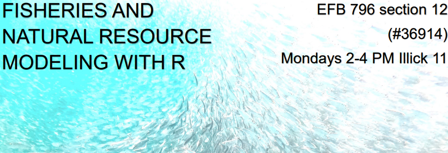

Welcome to Fisheries and Natural Resource Modeling with R!

This repository contains all course materials, including lectures, code, 
data, and homework assignments.  We recommend that you clone the repository
in RStudio, instructions for which can be found 
[here](https://happygitwithr.com/rstudio-git-github.html).  You can also 
download the entire repository by clicking on the green Code dropdown 
button and selecting "Download ZIP."  You can download individual files
by opening them on GitHub and either selecting "Raw" to view and copy/paste
the text, or by selection "download."  This will depend on the file type.

This repository will be updated as the course progresses, so keep
checking back for updates.  We will try our best to upload lectures and
code right after each class.  On occassion, we will also upload bonus code in
the Bonus folder.  If you have any questions about the bonus code or the topics
therein, feel free to send us an email or drop by office hours.

Looking forward to a great semester!
